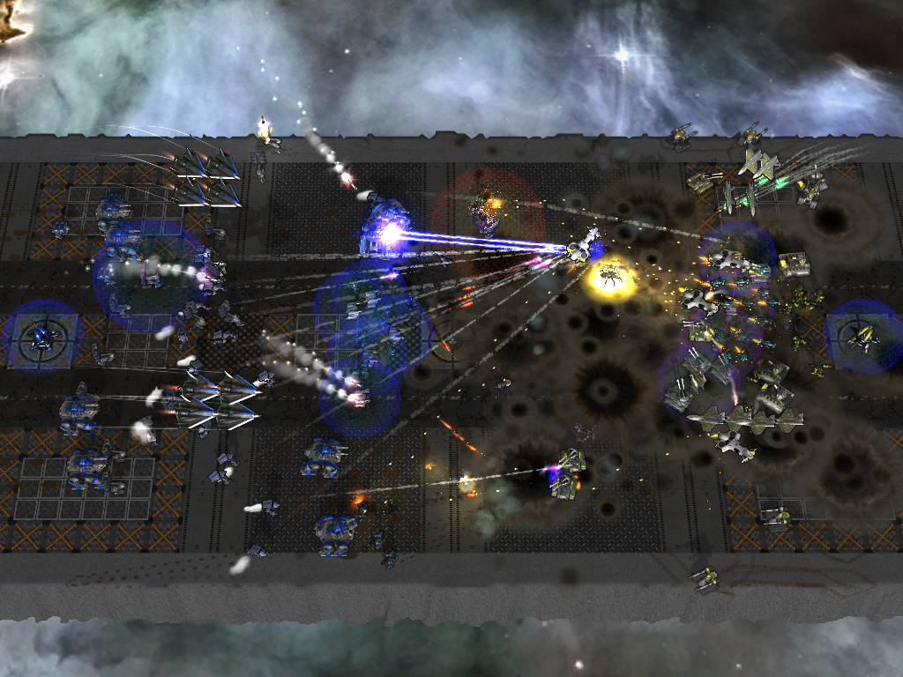

# Zero-Wars

A custom zero-k map mod: Send waves of units across the map to destroy the enemy nexus

## [Running In Singleplayer](https://zero-k.info/mediawiki/index.php?title=Mod_Creation#Running_your_mod_-_Singleplayer)

1. Copy the ZeroWars.sdd folder to your Zero-K/maps folder
2. Change the version of the mod in mapinfo.lua to a unique version
3. Restart Zero-k
4. Under Settings -> Lobby, disable "Only featued maps" to display on maps in the zero-k map folder
5. Run the map by making a singleplayer skirmish game and selecting the zerowars with your unique map version

#### Notes

* If you add or remove a file from the map you will have to restart zero-k
* Otherwise you just need to restart the match

## Useful Links

* [Spring Engine](https://springrts.com/wiki/Main_Page)
    * [Lua Callins](https://springrts.com/wiki/Lua:Callins)
    * [Lua SyncedCtrl](https://springrts.com/wiki/Lua_SyncedCtrl)
    * [Lua SyncedRead](https://springrts.com/wiki/Lua_SyncedRead)
    * [Lua UnsyncedCtrl](https://springrts.com/wiki/Lua_UnsyncedCtrl)
    * [Lua UnsyncedRead](https://springrts.com/wiki/Lua_UnsyncedRead)
* [ZK - Github](https://github.com/ZeroK-RTS/Zero-K)
* [ZK - Mod Creation](https://zero-k.info/mediawiki/index.php?title=Mod_Creation)
* [ZK - Custom Modes](https://zero-k.info/mediawiki/index.php?title=Custom_Modes)
* [ZK - Developing](https://zero-k.info/mediawiki/index.php?title=Zero-K:Developing)
